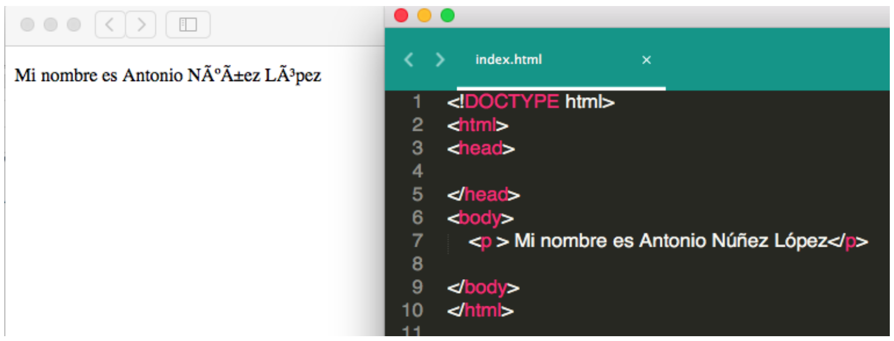
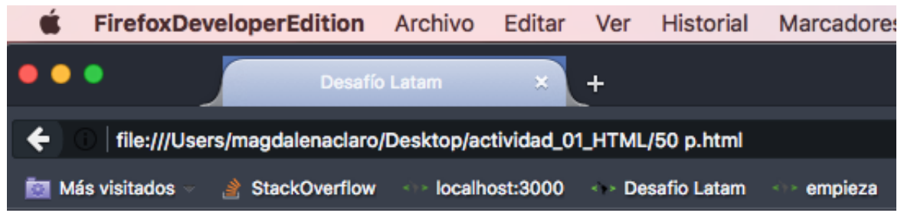
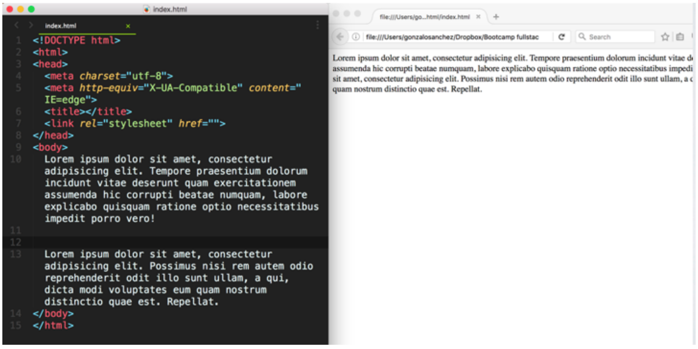

# Actividad 001 - HTML


### INSTRUCCIONES:

- Para poder realizar esta actividad debes haber realizado los cursos previos junto con haber visto los videos online correspondientes a la experiencia 1.
- Para realizar esta actividad debes realizar un fork de este repositorio, luego clonar el fork y corregir los errores de código de manera local con Sublime o Atom.
- Luego guarda los cambios y súbelos a tu repositorio de Github.
- Luego de pusheados los últimos cambios, sube el link de Github en el desafío de la sección correspondiente en la plataforma.

***

### Comencemos

##### Ejercicio 1

Además de encontrar el error de escritura de código, escribe el código necesario para que la página web quede con la estructura necesaria para HTML5.

Hint: Puedes utilizar el validador de la w3c para verificar el resultado

[https://validator.w3.org/#validate_by_input](https://validator.w3.org/#validate_by_input)

`
  hola 
 `

***

##### Ejercicio 2

¿Cuál es el error en el siguiente archivo HTML?

~~~html        
   <!DOCTYPE html>
 <html>
 <body>
     <title></title>
 </body>
<head>
 
 hola ! 

 </head>
 </html>
~~~
 
***

##### Ejercicio 3

¿Qué le falta al siguiente código para que no se vean esos caracteres extraños en la página?

~~~html
 <!DOCTYPE html>
 <html>
 <head>
 </head>
 <body>
     
 Mi nombre es Antonio Núñez López

 </body>
 </html>
~~~
 

***

 
##### Ejercicio 4
 
¿Qué le falta al siguiente código para que el título de la página (en el tab), se vea exactamente como en la imagen?

~~~html
 <!DOCTYPE html>
 <html>
 <head>
 </head>
<body>
 </body>
 </html>
~~~

***

##### Ejercicio 5

¿Qué error hay en la estructura de la siguiente página web?

~~~html
 <!DOCTYPE html>
 <html>
 <head>
     <meta charset="utf-8">
     <title></title>
     <link rel="stylesheet" href="">
 </head>
     <h1> Título 1 </h1>
<body>
 </body>
 </html>
~~~

***

##### Ejercicio 6

¿Por qué no se ven los saltos de línea? Se pide implementar los cambios necesarios para que visualmente se pueden ver los párrafos.

~~~html
  <!DOCTYPE html>
<html>
<head>
    <meta charset="utf-8">
    <meta http-equiv="X-UA-Compatible" content="IE=edge">
    <title></title>
    <link rel="stylesheet" href="">
</head>
<body>
    Lorem ipsum dolor sit amet, consectetur adipisicing elit. Distinctio recusandae c
ulpa, repellat ex nobis, qui. Quidem id amet, cumque, porro, et nulla provident, quis
 eum sequi excepturi incidunt similique voluptatum!
    Lorem ipsum dolor sit amet, consectetur adipisicing elit. Adipisci officiis ipsum
 rem quos. Placeat, pariatur rerum velit iste aliquid blanditiis sunt nesciunt distin
ctio vel, iure dolorum possimus expedita in non!
</body>
</html>
~~~

***

#### Ejercicio 7

Encontrar los errores en la siguiente página web y corregirlo, el texto que debe aparecer en pantalla es Párrafo 1

~~~html
 <!DOCTYPE html>
 <html>
 <head>
     <title></title>
 </head>
 <body>
     
 

 </body>
 </html>
~~~

***

#### Ejercicio 8

Encontrar el error en la siguiente página web y corregirlo.

~~~html
 <!DOCTYPE html>
 <html>
 <head>
     <meta charset="utf-8">
     <title></title>
     
 hola 

 </head>
 <body>
 </body>
 </html>
~~~

***

#### Ejercicio 9

Encontrar los errores en la siguiente página web y corregirlo.

~~~html
   <!DOCTYPE html>
 <html>
 <head>
     <meta charset="utf-8">
     <title></title>
 </head>
 <body>
     <a href="Soy un link"> www.google.cl </a>
 </body>
 </html>
~~~

***

#### Ejercicio 10

Corrige la estructura de la siguiente página web.

~~~html
  <!DOCTYPE html>
  <html>
  <head>
     <meta charset="utf-8">
     <title></title>
  </head>
<body>
     <h1> Hola </h1>
         Lorem ipsum dolor sit amet, consectetur adipisicing Tempore praesentium dolor
 um incidunt vitae deserunt quam exercitationem assumenda hic corrupti beatae numquam,
  labore explicabo quisquam ratione optio necessitatibus impedit porro vero!

     

         Lorem ipsum dolor sit amet, consectetur adipisicing elit. Repellat quisquam u
 nde dicta nulla tempora! Ad, modi eveniet dicta necessitatibus aut distinctio minus t
 enetur hic, delectus, doloremsuscipit doloribus ab eius.

  </body>
  </html>
~~~

***

#### Ejercicio 11

¿Cuál es el error?

~~~html
 <!DOCTYPE html>
 <html>
 <head>
     <meta charset="utf-8">
     <meta http-equiv="X-UA-Compatible" content="IE=edge">
     <title></title>
     <link rel="stylesheet" href="">
 </head>
 <body>
     <h1> Título !! </h1>
     

         Lorem ipsum dolor sit amet, consectetur adipisicing elit. Quaerat, velit dolo
 rem laudantium odio neque temporibus magnam praesentium unde doloremque perferendis r
 atione mollitia rem, consequuntur vitae soluta ex suscipit nobis optio!

     
     

         Lorem ipsum dolor sit amet, consectetur adipisicing elit. Placeat, dolorem pr
 aesentium quidem ex aut odit architecto, impedit, eveniet pariatur nam, sed cum qui n
 atus. Quod consequuntur mollitia, a voluptas. Accusamus.

 </body>
 </html>
~~~ 

***
 
#### Ejercicio 12

¿Qué le falta al href del link para que te redirecciones al link deseado?

Además debes lograr que la imagen funcione como un segundo link redirigiendo a Google.

~~~html
   <!DOCTYPE html>
 <html>
 <head>
     <meta charset="utf-8">
     <meta http-equiv="X-UA-Compatible" content="IE=edge">
     <title></title>
     <link rel="stylesheet" href="">
 </head>
 <body>
     <a href="www.desafiolatam.com">link a Desafío Latam!</a>
     
 </body>
 </html>
~~~

***

#### Ejercicio 13

Hay una foto en la carpeta images, la cual no carga :cold_sweat: se pide arreglar la carga.

~~~html
 <!DOCTYPE html>
 <html>
 <head>
     <meta charset="utf-8">
     <meta http-equiv="X-UA-Compatible" content="IE=edge">
     <title></title>
     <link rel="stylesheet" href="">
 </head>
 <body>
     
 </body>
 </html>
~~~ 

***

#### Ejercicio 14

La estructura de la siguiente página web tiene diversos errores, puedes encontrarlo y arreglarlos?

~~~html
   <!DOCTYPE html>
 <html>
 <head>
     <meta charset="utf-8">
     <meta http-equiv="X-UA-Compatible" content="IE=edge">
     <title></title>
     <link rel="stylesheet" href="">
 </head>
 <body>
     
     <a href="http://www.google.cl"> hola </a>
     </img>
 </body>
 </html>
~~~

***

#### Ejercicio 15

Corrige todos los errores (Hint: Son 8)

~~~html
  <!DOCTYPE html>
 <html>
 <head>
     <meta http-equiv="X-UA-Compatible" content="IE=edge">
     <title></title>
 <body>
     <meta charset="utf-8">
     <link rel="stylesheet" href="">
     <h1> Hola </h2>
         Lorem ipsum dolor sit amet, consectetur adipisicing elit. Amet voluptate volu
 ptas odit, sapiente soluta consectetur consequuntur ex est dolores laboriosam repudia
 ndae unde repellat velit quo voluptatibus consequatur perferendis, tempore sunt!

     
     

         Lorem ipsum dolor sit amet, consectetur adipisicing elit. Iste ex, enim ipsum
  sequi. Dignissimos libero unde repellendus fugit quidem asperiores, veritatis aliqui
 d vel, a eveniet praesentium labore quia dolor, accusamus?
     

 </body>
 </head>
<html>
~~~

***